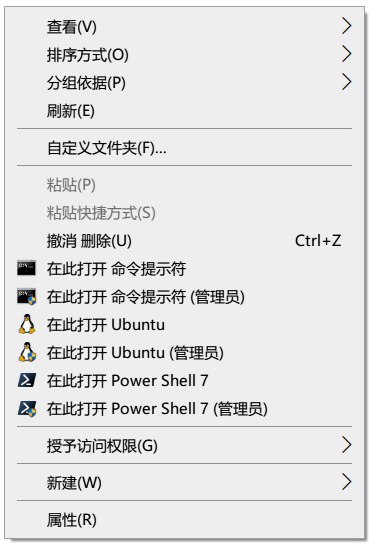

# PowerShell Scripts to Install/Uninstall Context Menu Items for Windows Terminal

*A project backed by [LeXtudio Inc.](https://www.lextudio.com)*

## 1. 部署

1. [安装 Windows Terminal](https://github.com/microsoft/terminal).
1. [安装 PowerShell 7](https://docs.microsoft.com/en-us/powershell/scripting/install/installing-powershell-core-on-windows?view=powershell-7).
1. 以**管理员身份**启动 PowerShell 7 控制台 (Powershell < 7 是**不行的**)，然后运行 `install.ps1` 脚本，将【右键菜单项】安装到 Windows 资源管理器。
    > 快速运行
    >```powershell
    > Set-ExecutionPolicy Bypass -Scope Process -Force; [System.Net.ServicePointManager]::SecurityProtocol = [System.Net.ServicePointManager]::SecurityProtocol -bor 3072; iex ((New-Object System.Net.WebClient).DownloadString('https://raw.githubusercontent.com/SplitGemini/windowsterminal-shell/master/install.ps1'))
    >``` 
1. 现在，菜单项已添加到 Windows 资源管理器右键菜单了。

## 2. 参数说明

### -Layout
> 可选：['Default', 'Flat', 'Mini']，默认为 `Default`

可直接运行 `.\install.ps1 mini` 或 `.\install.ps1 flat` 安装其他布局  
Default：  
  
Flat：  
  
Mini：  
 

### -PreRelease
支持PreRelease版本的Windows Terminal。

### -UseEnglish
Just English Version.  
默认为中文，参数添加`-UseEnglish`改为英文版本  
预览如下：    
Default：  
  
Flat：  
  
Mini：  
  

### -Extended
参数添加 `-Extended` 安装后，只有在按住 `Shift` 键之后按下右键才会显示安装的选项。[参照](https://docs.microsoft.com/en-us/windows/win32/shell/context#shortcut-menu-verbs)

### -MenuType
> 可选['Both', 'OnlyUser', 'OnlyAdmin']，默认为 `Both`

- OnlyUser: 只安装非管理员选项  
- OnlyAdmin: 只安装管理员选项  
- Both: 两者都安装  

### -Uninstall
使用该参数卸载菜单，不分种类，自动检测新旧版本。

## 3. 卸载

以管理员身份，在PowerShell Core 7中，执行 `.\install.ps1 -Uninstall` 即可删除配置。

## Profile
附加一个Windows Terminal profile
需要Module：
* [posh-git](https://github.com/dahlbyk/posh-git): 
* [oh-my-posh](https://github.com/JanDeDobbeleer/oh-my-posh): newest version 3+.
* [PSReadLine](https://github.com/PowerShell/PSReadLine): 2.20beta1.
* [PowerColorLS](https://github.com/SplitGemini/PowerColorLS): Customed by myself, but use [origin version](https://github.com/gardebring/PowerColorLS) is ok.
* [ZLocation](https://github.com/vors/ZLocation): z command like z.sh.
* [Get-MediaInfo](https://github.com/stax76/Get-MediaInfo): just get mediainfo.  
  
需要同目录的[Update-AllPowerShellModules.ps1](Update-AllPowerShellModules.ps1)，使用`Update-Pip`更新pip，`Update-Modules`更新所有module，`Update-All`更新俩者。
会自动设置代理，默认端口1080，自动判断terminal是不是Windows Terminal，如果不是不初始化前面的所有模块和设置，目的是加快启动速度，单脚本大多不需要这些模块
可通过`$IsWindowsTerminal`参数判断在不在Windows Terminal中

## Scripts
零碎的脚本，带FFMPEG需要环境变量有FFMPEG，带QAAC的需要QAAC
* 2m4a.ps1: FFMPEG 转换视频到m4a
* deleteSerialNumber.ps1: 删除文件名中的`(1)`，`- 副本`，`- 复制`
* normalize.ps1: FFMPEG 响度正则化音频
* qaac.ps1: QAAC 转换音频到m4a
* removeMeta.ps1: FFMPEG 删除媒体metadata
* split_long_m4a_and_lrc.ps1: QAAC 分割1小时以上的长m4a和lrc
* swap.ps1: FFMPEG 交换左右声道
* t2s.ps1: 繁体转简体，需要cc.py，且有OpenCC包


## 4. 注意

- 当前版本仅支持 Windows 10；
- `install.ps1` 脚本**必须**以管理员身份运行；
- **必须**在版本 >= 7 的 PowerShell 下执行脚本；
- `install.ps1` 仅操作上下文菜单项的 Windows 资源管理器设置，而不写入 Windows Terminal 的设置；
- 从 GitHub 下载 Windows Terminal 图标 (在 `install.ps1` 中) 需要 Internet 连接，最好在运行 `install.ps1` 时，将代理软件设置为全局代理；
- 善用`Tab`自动补全